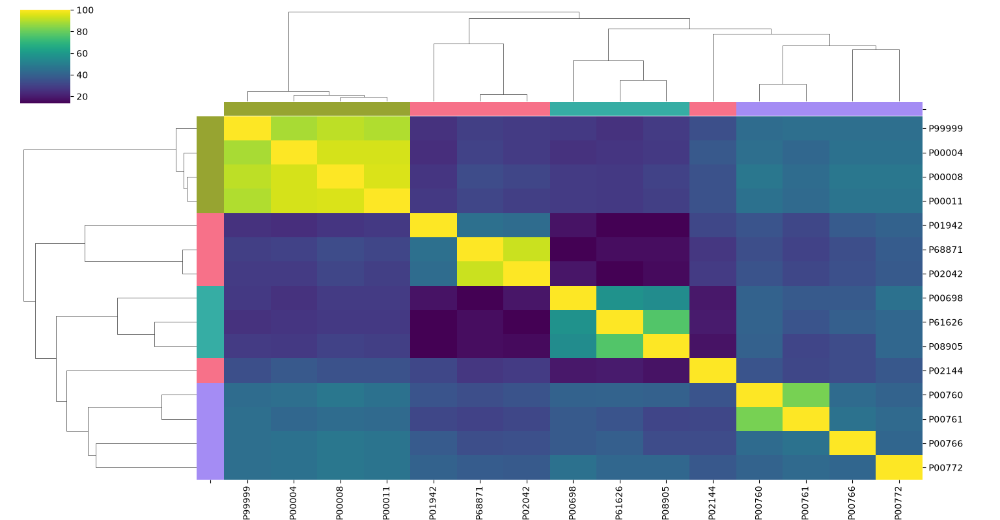
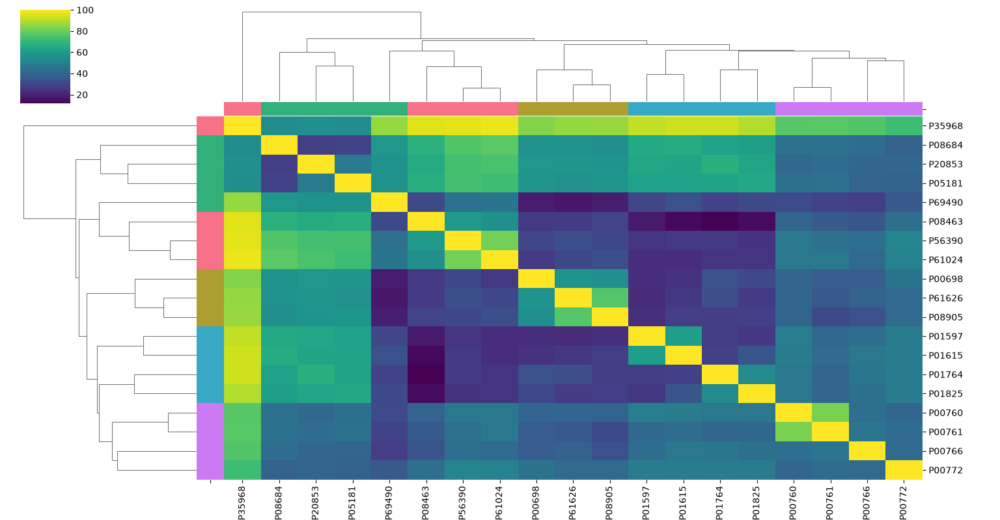

# Task 1: Protein Sequence Similarity and Clustering

## Objective

- Download 20–30 protein sequences belonging to 3–4 different protein families from UniProt.
- Calculate pairwise sequence identity or similarity.
- Construct a similarity matrix and visualize it as a heatmap.
- Use hierarchical clustering to group the proteins.
- Compare whether the computational clusters correspond to the known protein families.

## Procedure

1. I researched some protein families online, then looked them up on UniProt.
2. Then I scrolled through the results and noted down the accession ID for each protein.
3. Picked families and proteins to test with.My first attempt uses 5 families with 4 proteins each: Kinases, GPCRs, Cytochromes, Immunoglobulins, and ATP Synthases. Also tried a second version with 4 families and 4 proteins each.
4. I discovered the Fasta rest Api so, instead of copying each sequence manually from the UniProt website, used UniProt's FASTA REST API: given an accession ID, it returns the sequence directly. Much faster than doing it by hand.
5. Read through Biopython's [pairwise sequence alignment documentation](https://biopython.org/docs/dev/Tutorial/chapter_pairwise.html) to understand the alignment tools.
6. Watched [this video](https://youtu.be/9-PPZlD9F1A?si=xTxlEcOiH6aHqcBR), which helped a lot in understanding the concept more deeply.
7. In the main loop, used `aligner.align()` and took index `[0]` — this is the single best-scoring alignment.
8. Calculated percent identity as:
   ```python
   score = (matches / min(len(seq1), len(seq2))) * 100
   ```
9. Wrote each score to both sides of the matrix:
   ```python
   matrix.loc[id1,id2] = score
   matrix.loc[id2,id1] = score
   ```
   This fills in both (row A, col B) and (row B, col A) at once, giving the mirror-symmetric matrix that `seaborn.clustermap` needs.
10. Skimmed through the Seaborn documentation to build a clustered heatmap. Decided a clustermap would show the clustering better than a plain heatmap, and it also saved me from building the branches by hand in Matplotlib (I was also facing some difficulty in the making of the heatmap in matplotlib). Wrote the clustering code after going through the docs and some AI help.

## What the Graph Shows

- **Diagonal line:** the bright yellow line running from top-left to bottom-right is expected. Each protein compared against itself is a 100% match (Btw, in this case its alright but 100% doesn't mean two sequeneces are the same).
- **Dendrograms:** the branching lines on the top and left side show how the algorithm grouped the sequences hierarchically based on similarity score. Shorter branches mean higher similarity.
- **Family prediction:** for most proteins, high sequence identity computationally predicts the correct biological family with good accuracy.

## Notes

Spent a lot of time debugging mainly understanding the `Align` functions, working through the Biopython documentation, and figuring out the main loop (also writing out the try except functions were a major challenge). Between that and reading the docs plus using AI for help, this step took a while.

## Results

### Result 1 — `task1-result-1`

4 families, 4 proteins each: Globin, Cytochrome C, Lysozyme, Protease.

| Accession | Family |
|-----------|--------|
| P68871 | Globin |
| P02042 | Globin |
| P01942 | Globin |
| P02144 | Globin |
| P00004 | Cytochrome_C |
| P99999 | Cytochrome_C |
| P00008 | Cytochrome_C |
| P00011 | Cytochrome_C |
| P00698 | Lysozyme |
| P61626 | Lysozyme |
| P08905 | Lysozyme |
| P00695 | Lysozyme |
| P00760 | Protease |
| P00766 | Protease |
| P00772 | Protease |
| P00761 | Protease |



### Result 2 — `task1-result-2`

5 families, 4 proteins each: Kinases, Lysozyme, Cytochromes, Immunoglobulins, Protease.

| Accession | Family |
|-----------|--------|
| P56390 | Kinases |
| P35968 | Kinases |
| P61024 | Kinases |
| P08463 | Kinases |
| P00698 | Lysozyme |
| P61626 | Lysozyme |
| P08905 | Lysozyme |
| P00695 | Lysozyme |
| P20853 | Cytochromes |
| P08684 | Cytochromes |
| P05181 | Cytochromes |
| P69490 | Cytochromes |
| P01597 | Immunoglobulins |
| P01615 | Immunoglobulins |
| P01764 | Immunoglobulins |
| P01825 | Immunoglobulins |
| P00760 | Protease |
| P00766 | Protease |
| P00772 | Protease |
| P00761 | Protease |

