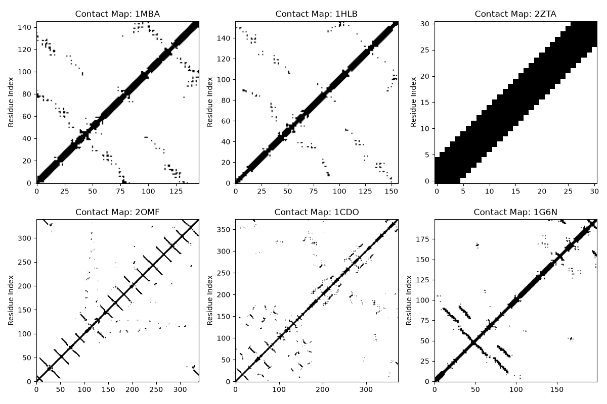

# Task 2: Protein Contact-Map Generation

## Objective

- Download 5–10 protein structures from the PDB.
- Calculate all pairwise Cα distances.
- Define two residues as being in contact when their Cα atoms are within a chosen cutoff, for example 8 Å.
- Construct and plot the residue-residue contact map for each protein.
- Compare contact maps of predominantly α-helical and predominantly β-sheet proteins.

## Procedure

1. First, selected some proteins and noted their PDB IDs, then retrieved the structures from the PDB — the files get downloaded into a local folder. Picked 3 alpha-helical proteins (1MBA – Myoglobin, 1HLB – Hemoglobin, 2ZTA – Leucine zipper) and 3 beta-sheet proteins (2OMF – Porin, 1CDO – Concanavalin A, 1G6N – Green Fluorescent Protein).
2. The main task is getting the Cα coordinates to compute pairwise distances. Spent a lot of time going through the Biopython docs to understand how this works. Used a `PDBParser` to load the file into a Python object.
3. A single PDB file can contain multiple structures of the same protein — just grab the first structure, and the first chain of it.
4. Created an empty list `ca_coords`, looped through each residue in the chain, and whenever a residue has a `'CA'` atom, grabbed its coordinates and appended them to `ca_coords`.
5. Used `pdist` from SciPy to compute pairwise distances, then `squareform` to turn that into a full distance matrix so it can be plotted. Example of how it works:

   ```python
   # sample residue coordinates (X, Y, Z)
   coords = np.array([
       [0, 0, 0],  # Residue 0
       [3, 0, 0],  # Residue 1
       [0, 4, 0],  # Residue 2
       [3, 4, 0]   # Residue 3
   ])

   print(squareform(pdist(coords)))
   ```

   Output:

   ```python
   [[0. 3. 4. 5.]
    [3. 0. 5. 4.]
    [4. 5. 0. 3.]
    [5. 4. 3. 0.]]
   ```

   Read as a table:

   |             | Residue 0 | Residue 1 | Residue 2 | Residue 3 |
   |-------------|-----------|-----------|-----------|-----------|
   | **Residue 0** | 0.0       | 3.0       | 4.0       | 5.0       |
   | **Residue 1** | 3.0       | 0.0       | 5.0       | 4.0       |
   | **Residue 2** | 4.0       | 5.0       | 0.0       | 3.0       |
   | **Residue 3** | 5.0       | 4.0       | 3.0       | 0.0       |

   This matrix is what gets plotted.

6. Referred to the [Wikipedia page on protein contact maps](https://en.wikipedia.org/wiki/Protein_contact_map) to understand how they work, then picked a cutoff distance.
7. Built a `coords` object using the `get_ca_coords` function, computed the `dist_matrix`, and masked out every distance greater than the cutoff.
8. Finally, built the contact map from what was left.

## Comparing α-Helical and β-Sheet Contact Maps

A contact map plots sequence index against sequence index, so the main diagonal (x = y) is always completely solid — a residue is always at 0 distance from itself. The interesting information is in the patterns branching off that diagonal.

### Predominantly α-Helical Proteins (e.g., Myoglobin – 1MBA)

- **Visual pattern:** thick, dark bands running immediately adjacent and parallel to the main diagonal.
- **Why it looks like this:** in an α-helix, a residue at position *i* hydrogen-bonds with a residue at position *i+4*. Since interacting residues are close together in the sequence, the contacts stay tightly clustered around the main diagonal.

### Predominantly β-Sheet Proteins (e.g., Porin – 2OMF)

- **Visual pattern:** distinct lines or bands appearing far away from the main diagonal.
- **Why it looks like this:** β-sheets are formed by distant segments of the sequence folding back and pairing up with each other.
  - Anti-parallel β-sheets show up as bands running perpendicular (90°) to the main diagonal.
  - Parallel β-sheets show up as bands running parallel to the main diagonal, but offset significantly from it.

## Result
